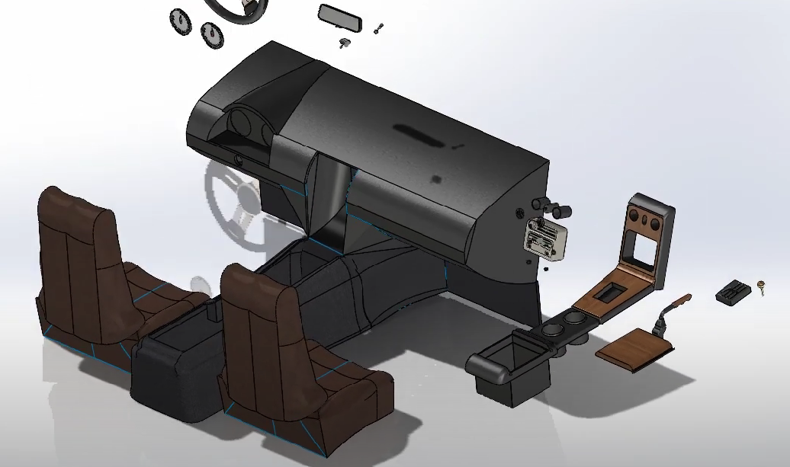

# Mazda MX5 Miata SolidWorks

Welcome to the Mazda MX5 Miata SolidWorks project repository. This project contains a detailed 3D model of a Mazda MX5 Miata created using SolidWorks.

## Table of Contents

- [Introduction](#introduction)
- [Features](#features)
- [Video](#video)
- [Improvements](#improvements)

## Introduction

This repository showcases a 3D model of a Mazda MX5 Miata designed in SolidWorks. The project aims to demonstrate my skills in 3D modeling and CAD design, and serves as a portfolio piece for potential employers.

## Features

- Detailed 3D model of a Mazda MX5 Miata
- Fully editable SolidWorks files
- High-quality renderings and screenshots
- Organized file structure

## Video

Here is a video showcasing the Mazda MX5 Miata model:

*Click on the image to watch the video.*

## Improvements

While I am incredibly proud of the work done on this project, there are some areas for improvement:

- **Blue Lines on Surfaces:** The blue lines visible within the model are caused by issues with surface continuity and the way surfaces were patched together. This can be improved by ensuring that all surface edges are properly trimmed and knitted together, which will create a more seamless appearance.
  
- **Detail Enhancements:** Adding more intricate details to smaller components like the dashboard buttons or seat stitching can enhance the realism of the model.
  
